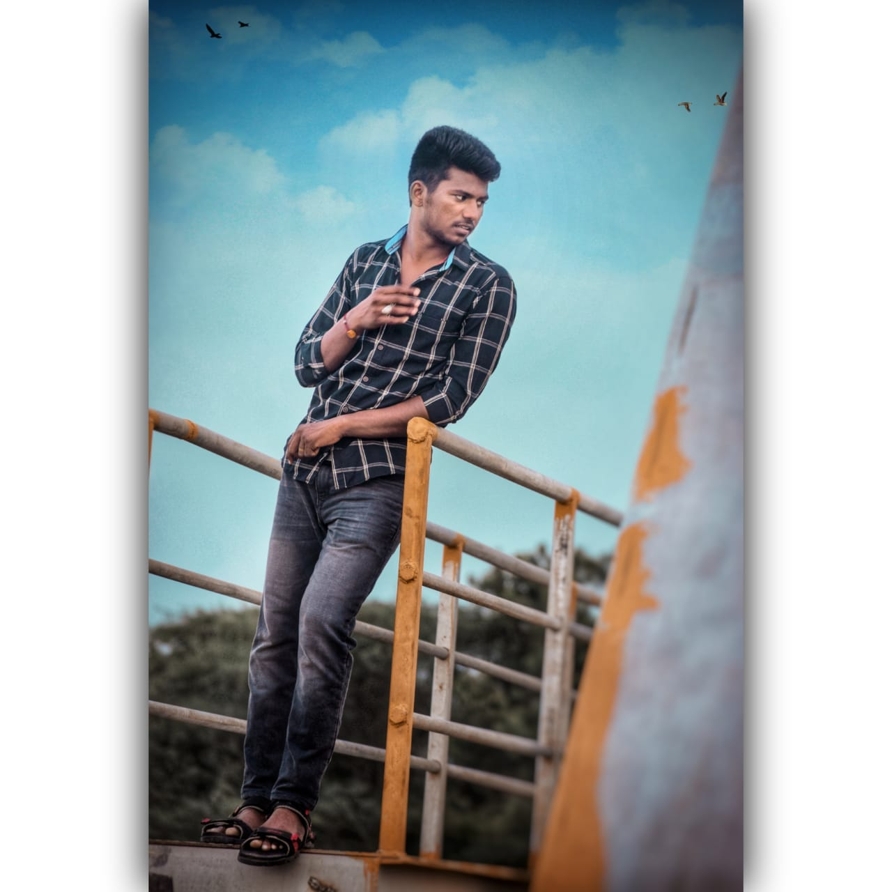

# Kunchala Brahma Teja
There is a song in my childhood named as donu donu and the movie name was Maari which is really a good song in my childhood i really enjoyed while listening this song.

---

## Table

This table gives details about my favourite songs

| Song name | Reason | Lyric writer |
| :--- | :---: | ---: |
| The Maari swag | Mass song | Dhanush |
| Rowdy baby | Love song | Yuvan shankar raja |
| Oru vidha aasai | Sad song | Chandrabose |
| Pove po | Love failure song | Anirudh |
---
## Quotes

> Amateurs sit and wait for inspiration, the rest of us just get up and go to work. – *Stephen King*
>
> Self-awareness and self-love matter. Who we are is how we lead. – *Brene Brown*

---

## Code Fencing
Create a virtual environment in Python to manage dependencies.

python -m venv projectnamevenv

Link to the snippet source https://code.pieces.app/collections/python